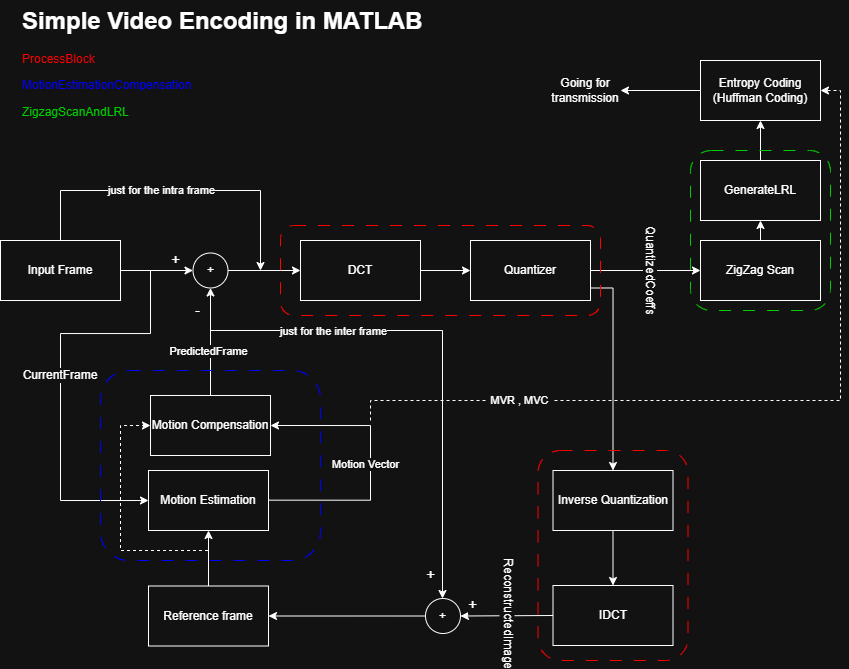
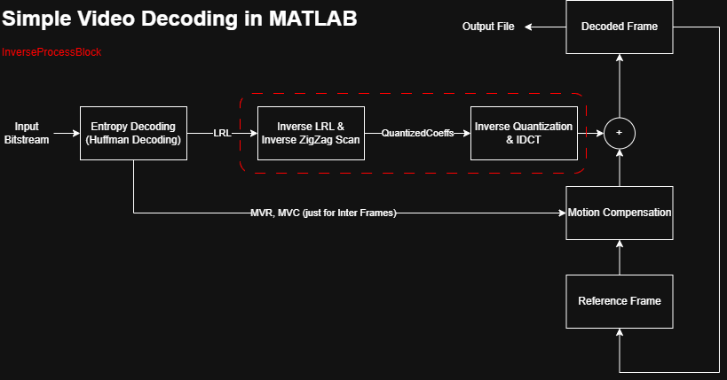

# Simple Video Codec (Encoder & Decoder) in MATLAB

This repository contains a comprehensive, custom video codec implemented entirely in MATLAB from scratch. The project demonstrates the fundamental concepts of modern video compression standards (like MPEG), covering both the **Encoding** and **Decoding** pipelines. 

The codec currently operates on raw YUV video files (specifically the QCIF `176x144` format) and processes only the luminance (`Y`) component to demonstrate the core concepts of spatial and temporal compression.

## System Architecture

### Encoder Pipeline

### Decoder Pipeline

## How It Works

### 1. Encoder (`Main.m`)
The encoder processes the uncompressed YUV sequence and outputs a custom compressed bitstream (`EncodedVideo.mpeg`). 
* **Intra-frame (I-Frame):** The first frame is encoded independently to exploit spatial redundancy. It is divided into `8x8` blocks, transformed using **Discrete Cosine Transform (DCT)**, quantized using an Intra-quantization matrix (`Q_intra`), scanned in a **Zigzag** pattern, compressed via **Level-Run-Length (LRL)** coding, and finally entropy-coded using **Huffman Coding**.
* **Inter-frame (P-Frames):** Subsequent frames rely on temporal redundancy reduction. 
  * **Motion Estimation (ME):** A Full-Search algorithm is performed on `16x16` macroblocks.
  * **Motion Compensation (MC):** Generates a predicted frame based on the reference frame and Motion Vectors.
  * The residual (error) between the current frame and the predicted frame undergoes DCT, Inter-quantization (`Q_inter`), Zigzag scan, LRL, and Huffman coding.
  * Motion Vectors (MVs) are also compressed using a dedicated Huffman table.

### 2. Decoder (`MainDecoder.m`)
The decoder reads the custom `EncodedVideo.mpeg` bitstream and completely reconstructs the video sequence.
* **Entropy Decoding:** Parses the bitstream using Huffman Decoding to accurately retrieve LRL codes and Motion Vectors.
* **Inverse Transformations:** Applies Inverse LRL and Inverse Zigzag scan to rebuild the quantized `8x8` blocks.
* **Inverse Quantization & IDCT:** Recovers the spatial domain pixels (for the I-frame) or the residual pixel errors (for P-frames).
* **Motion Compensation (P-Frames):** Uses the decoded Motion Vectors and the previously reconstructed frame to predict the current frame, adding the decoded residual to generate the final image.

## Inputs & Outputs
* **Input:** `foreman_qcif.yuv` (Raw YUV video, 176x144 resolution).
* **Bitstream:** `EncodedVideo.mpeg` (Custom binary file containing the Huffman-coded stream).
* **Output:** Decoded YUV file (The final video reconstructed by the decoder pipeline).

## How to Run

1. Clone the repository and ensure you have MATLAB installed.
2. Place your raw YUV file (e.g., `foreman_qcif.yuv`) in the project's root directory.
3. **Encoding:** Run `Main.m`. This will process the video and generate `EncodedVideo.mpeg`.
4. **Decoding:** Run `MainDecoder.m`. This script will read the custom bitstream and output the fully decoded YUV sequence.
5. **Viewing:** Use a raw YUV player (such as the provided `YUVviewer.exe`) to compare the original raw video with the final decoded output.

---
*Developed by [Amin Maky](https://github.com/Amin-Maky)*
