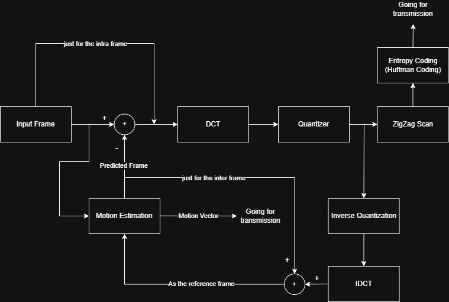

# Simple Video Encoding in Matlab

*Note: In the block diagram above, the components enclosed in colored dashed lines correspond to the specific MATLAB functions written in the matching colors (e.g., ProcessBlock, MotionEstimationCompensation, ZigzagScanAndLRL).*

This project implements a simplified, custom video encoder in MATLAB. It processes raw YUV video files (specifically the Luminance/Y component) and demonstrates fundamental video compression techniques including Intra-frame and Inter-frame encoding, Motion Estimation, DCT, Quantization, and Entropy Coding.

## Overview

The encoder is designed to process the `foreman_qcif.yuv` video sequence (Resolution: $176 \times 144$). It generates a custom encoded bitstream (`EncodedVideo.mpeg`) and a reconstructed video file (`reconstructed.yuv`) to verify the encoding/decoding loop's integrity.

**Note:** The output `.mpeg` file is a custom raw bitstream containing Huffman codes and is not a standard playable video file.

## Features & Encoding Pipeline

*   **Luminance Processing:** Only the Y (luminance) component of the video is processed to simplify the pipeline.
*   **Intra-frame Encoding (First Frame):** 
    *   Divides the frame into $8 \times 8$ blocks.
    *   Applies Discrete Cosine Transform (DCT).
    *   Quantizes the coefficients (using $Q_{intra}$).
    *   Performs Zigzag scanning and Level-Run-Length (LRL) encoding.
    *   Applies Huffman coding to generate the bitstream.
*   **Inter-frame Encoding (Subsequent Frames):**
    *   Performs Full-Search Motion Estimation on $16 \times 16$ Macroblocks to find Motion Vectors (MVs).
    *   Generates a Predicted Frame via Motion Compensation.
    *   Calculates the Residual (Error) between the current frame and predicted frame.
    *   Encodes the Residual using the same $8 \times 8$ DCT, Quantization ($Q_{inter}$), Zigzag, and Huffman pipeline.
    *   Encodes the Motion Vectors using a dedicated Huffman table.
## Tools & Future Work
*   **View Raw Video:** You can use `YUVviewer.exe` to visualize and inspect the raw YUV video files used in this project.
*   **Future Development:**  I plan to design and implement the corresponding video decoder to complete the encoding/decoding loop.